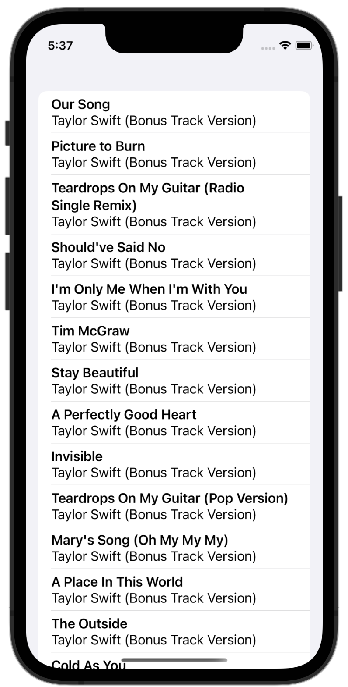
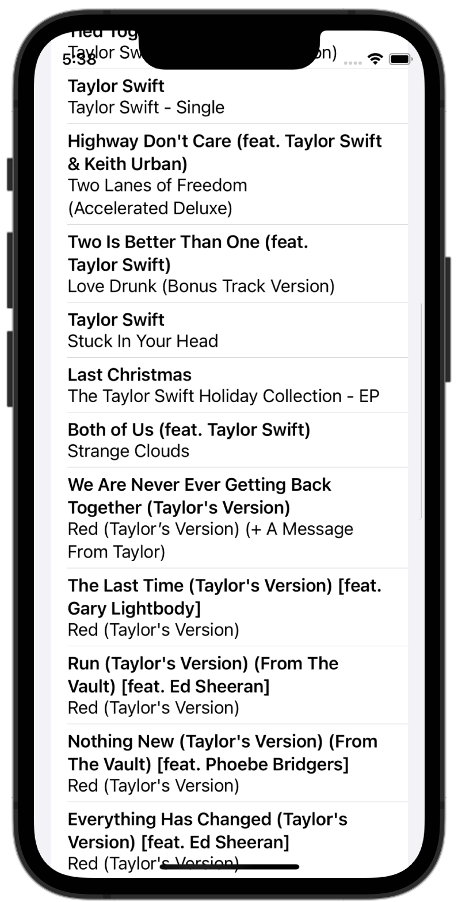

# SwiftUI-Learn
This repository is for storing files that I created for learning.

## Screenshots

### Networking
|Name|Description|Screenshots|
|--|--|--|
|[Intro To Networking](Networking/IntroToNetworking)|Retrieve Taylor Swift's Songs from iTunes||

### Design Patterns
|Name|Description|Screenshots|
|--|--|--|
|[SwiftUI MVVC](DesignPattern/SwiftUI-MVVC)|Move Network Mudule from View to ViewModel||
